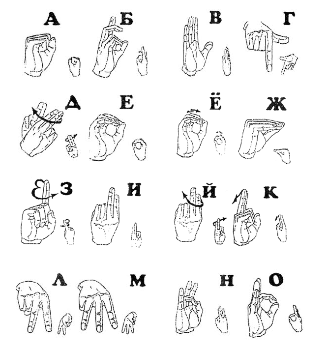

# hand-gesture-recognitionLOL

Энэ git дээр Монгол дохионы хэл (Mongolian Sign Language) танилт гэсэн төслийн код болон бусад өгөгдлийг хэрэгжүүлнэ. Энэхүү төслийн зорилго нь компьютерийн камер ашиглан хэрэглэгчийн гарын дохиог хүлээн авч, түүнийг текс болгон хөрвүүлэх юм.
